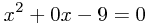

LatexServer
===
A server to provide image from **LateX** formulas

 Provides a simple image server to respond an API and render formulas as images

# Table of Contents
* [How it Works](#how-it-works)
* [Install and Dependencies](#install-and-dependencies)
* [Start](#start)


# How it Works
 - Get a formula LateX tha you want: `x^2 + 0x - 9 = 0`
 - urlencode it `x^2 + 0x - 9 = 0` turn `x%5E2%20%2B%200x%20-%209%20%3D%200`
 - repace it in a templated path `/formula/{urlencoded_latex}/size/{size}`


```html
 
```
renders:



# Install and Dependencies

System dependencies:

```bash
$ sudo apt-get install imagemagick libmagickcore-dev

$ sudo apt-get install texlive texlive-latex-extra

$ sudo apt-get install texinfo
```

Install gems of project
```bash
# in project root path
$ bundle install

```

# Start
```bash
rackup
```
or if want specify port and config.ru file
```bash
rackup -p 80 -D config.ru
```

Schedule to restart 
(if not have a app server)
```bash
*/2 * * * *  /bin/bash -l -c 'cd #{APP_FULL_PATH}/current && #{BUNDLER_FULL_PATH} exec rack$
```


